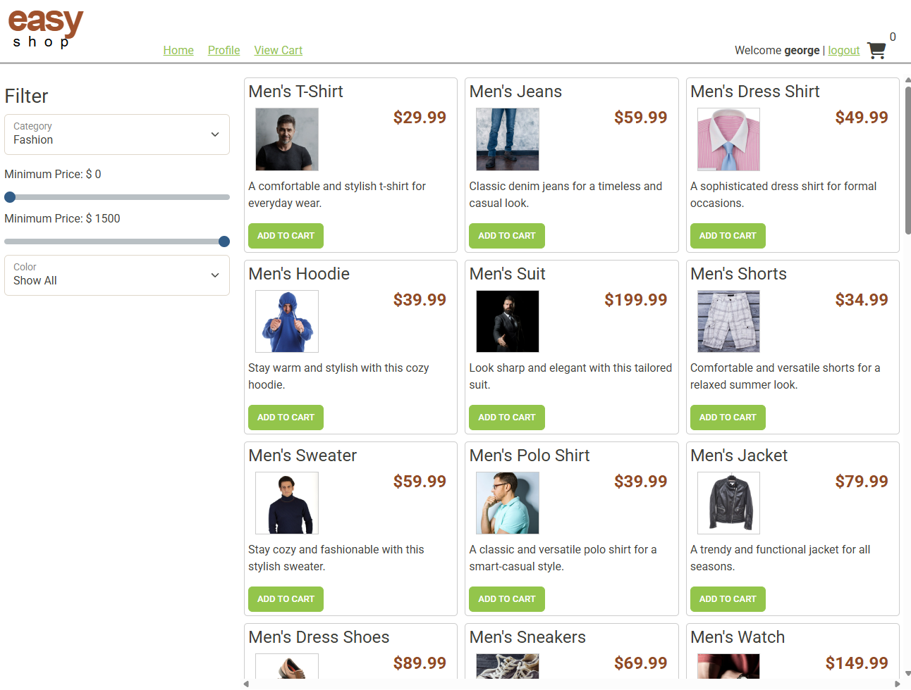
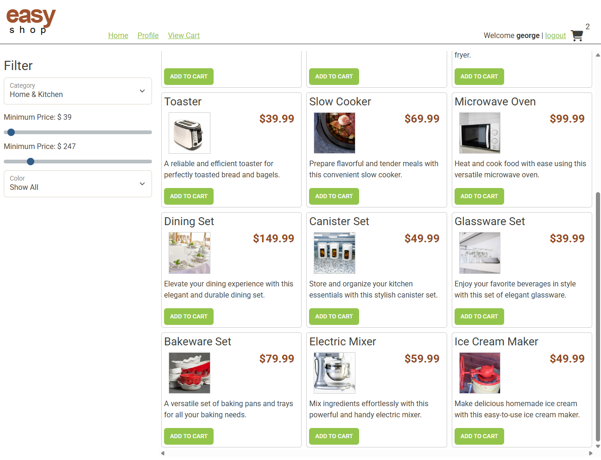
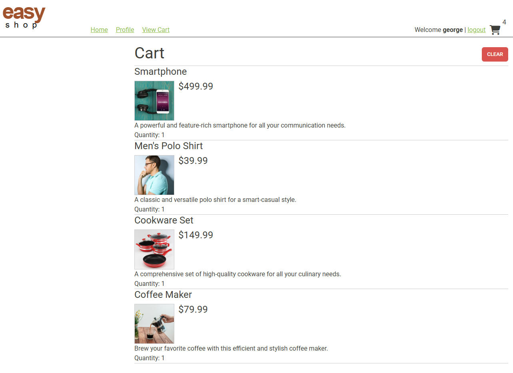
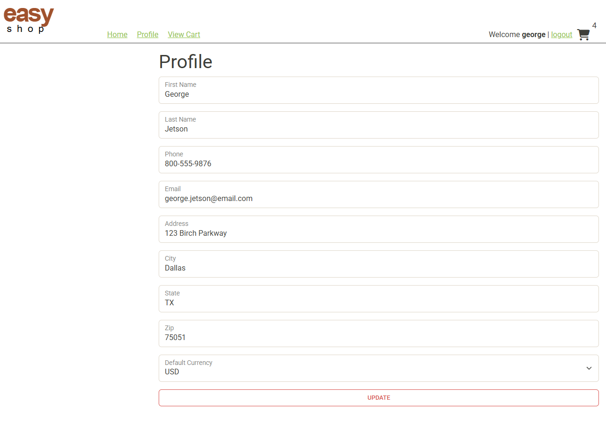
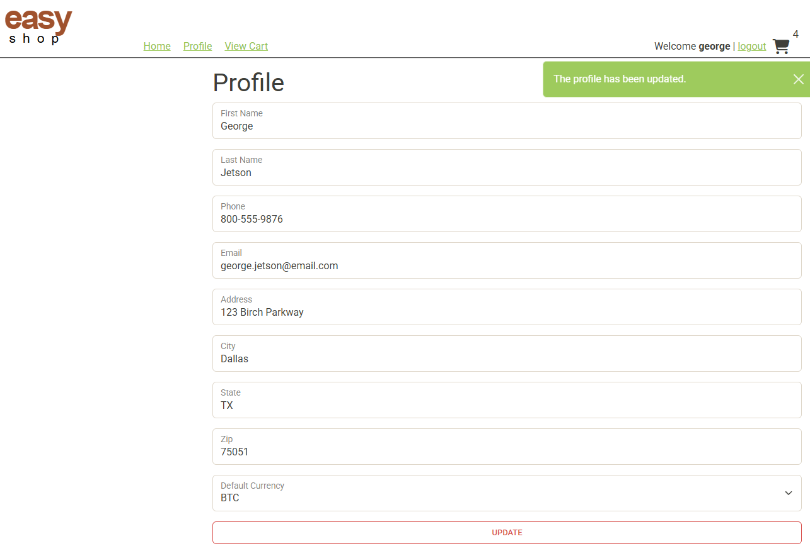
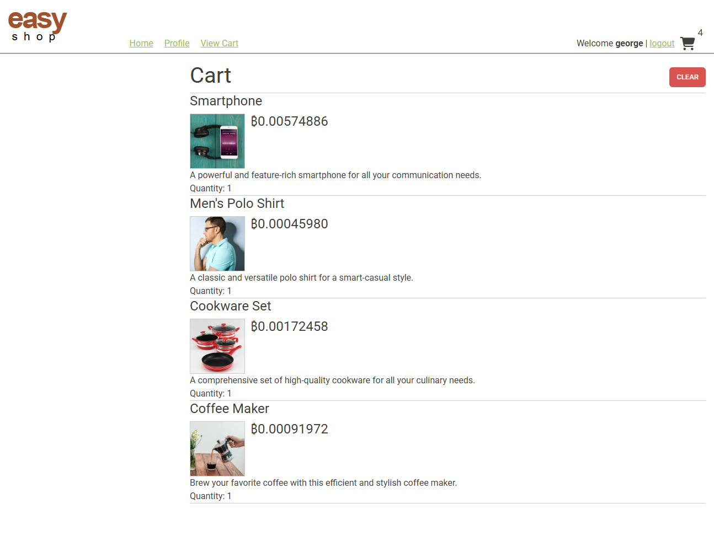
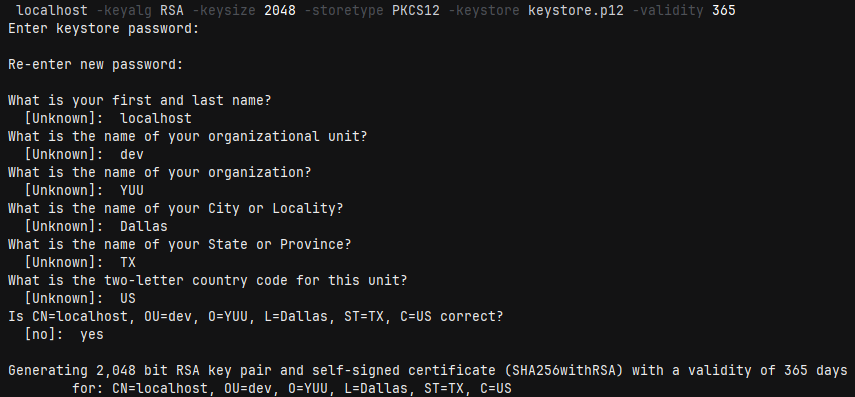
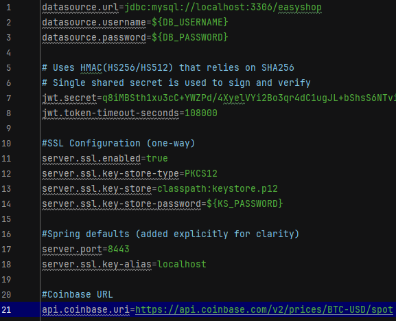
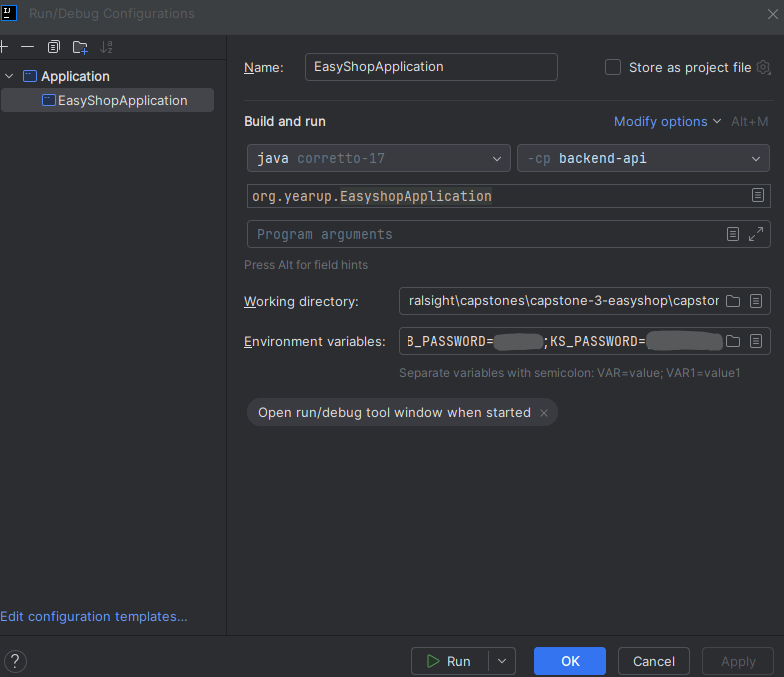

# Capstone 3 – EasyShop (Backend + Frontend)

## Project Overview
- This project is an E-Commerce web application built with Java, JavaScript and Spring Boot implementing RESTful API.
- The backend connects to a SQL database and manages authentication, authorization, product search, category filtering, user profiles and shopping cart functionality.

## Built With
[](https://www.java.com/en/)

## Features
- Category Filter
  - Users can filter product by category including Electronics, Fashion and Home & Kitchen.
- Price filter
  - Users can set a minimum and maximum price to filter products.
- Users Profile
  - Users can update their profile information.
  - Users can choose a default currency (USD or BTC).
- Shopping Cart
  - Users can view items added to their cart including price and quantity.
  - Users can clear all items from their cart.

## Usage Display
### Home Page:


### Category Filter (Fashion):


### Price + Category Filter (Home & Kitchen):


### Cart:


### User Profile:


### User Profile (Update Default Currency to BTC):


### Home Page (User Default Currency Set to BTC):


### Cart (User Default Currency Set to BTC):


## Interesting Feature / Code Added
### Generated SSL Certificate Using Keytool:


### SSL Configuration & Coinbase API Added to application.properties:


### Used Environment Variables in Configuration to Privately Store Passwords:


### Client class calls the Coinbase API, sends GET request and retrieves BTC spot price as a JSON response body:
```java
@Component
public class CoinbaseBtcUsdClient {
    //HttpClient sends and receives requests/responses
    //Used here to call Coinbase API and receive the body as JSON text
    private static final HttpClient CLIENT = HttpClient.newHttpClient();
    private final String url;

    @Autowired
    public CoinbaseBtcUsdClient(@Value("${api.coinbase.uri}") String url){
        this.url = url;
    }

    public String fetchBtcUsdJson() throws Exception{
        URI uri = URI.create(url);
        //builds HTTP GET request to the provided URI (no body required)
        HttpRequest request = HttpRequest.newBuilder(uri).header("Accept", "application/json").GET().build();
        //sends the request and converts response body (JSON bytes) to a String
        HttpResponse<String> response = CLIENT.send(request, HttpResponse.BodyHandlers.ofString());

        if (response.statusCode() / 100 !=2){ //integer division gives exactly 2 (allows all 2xx codes)
            throw new RuntimeException("Coinbase request failed: HTTP " + response.statusCode() + " body=" + response.body());
        }
        return response.body();
    }
}
```

### Service class calls the client, parses the JSON response body and maps it into a domain model:
```java
@Component
public class CoinbaseBtcPriceService {
    private CoinbaseBtcUsdClient client;
    private ObjectMapper objectMapper;

    public CoinbaseBtcPriceService(CoinbaseBtcUsdClient client, ObjectMapper objectMapper){
        this.client = client;
        this.objectMapper = objectMapper;
    }

    public BtcPriceDomainModel getSpotPrice() throws Exception {
       //gets JSON as String
        String json = client.fetchBtcUsdJson();
        //parses JSON String into outer DTO
        CoinbaseSpotPriceResponse response = objectMapper.readValue(json, CoinbaseSpotPriceResponse.class);
        //records into nested DTO
        CoinbaseData data = response.data();
        //map DTO into domain model
        BigDecimal amount = new BigDecimal(data.amount());
        //return new domain model
        return new BtcPriceDomainModel(data.base(), data.currency(), amount);
    }
}
```